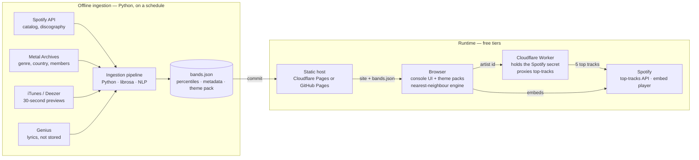

# vibepult — Design Doc

As of 5 October 2026 · Vibepult

## Concept

A web app that looks like a mixing console. Instead of channel gain, the faders tune perceptual qualities of metal: aggression, serenity, darkness, grandeur. Set the desk, and it answers with one band and that band's 5 most popular tracks as Spotify embeds.

The seed observation: within one genre, Mayhem and Elderwind sit at opposite ends of a spectrum that is not about tempo or tuning. It is about violence versus nature, cartoonish versus serene. That spectrum is measurable from audio and lyrics, so it can be a control.

Each fader is a weighted blend of low-level measurable features, never a single measurement. Every band becomes a point in fader space; the console does a nearest-neighbour lookup. The desk re-skins to match the result band's subgenre: bone and corpse paint for black metal, chrome and neon for industrial, oak and iron for folk.

## Decisions so far

| Decision | Choice |
| --- | --- |
| Output | One band name + 5 top tracks as Spotify embeds |
| Audio source for analysis | 30-second previews from iTunes Search API, Deezer as fallback for regional gaps, never Spotify's API |
| Universe | All metal; start with 100 bands, grow by ingesting only the new bands |
| Seed selection | Curated sample across subgenres, including the serene and cartoonish extremes, not popularity-sorted |
| Tracks per band for ingestion | Walk the discography, ~8 per album up to ~60; output's top-5 is separate |
| Fader values | Weighted blends of measurable features; weights are a tunable matrix |
| Controls | 8 perceptual faders + ~16 metadata knobs, switches, selectors; every control can be bypassed by the user |
| Per-band aggregation | Median plus IQR over tracks |
| Stored scale | Raw per-band feature values, immutable once ingested; percentiles derived at publish time |
| Theme | Follows the result band's subgenre tag |
| Spotify user login | Never; client credentials server-side, embeds for playback |
| Query engine | Client-side nearest neighbour over a shipped JSON |
| Hosting | Static site + one serverless worker, free tiers |
| Lyrics storage | Derived features only, never lyric text |
| Bandcamp full tracks | Later |

## Controls

Four control types, matching a real desk. Faders and knobs feed the nearest-neighbour distance; switches and selectors filter the pool first. Every control has a bypass button: a bypassed control drops out of the distance calculation and greys out.

**Faders** (continuous, perceptual, computed blends of features in the next section)

| Fader | Built from |
| --- | --- |
| Aggression | tempo, blast density, harsh-vocal ratio, loudness, violence/gore lyric themes |
| Serenity | clean/acoustic share, keyboard presence, slower tempo, nature/landscape themes |
| Darkness | minor-key share, low spectral centroid, occult/misanthropy/death themes |
| Grandeur | song length, orchestration, dynamic range, low structural repetitiveness |
| Rawness | low dynamic range, high spectral flatness, narrow stereo, lo-fi loudness profile |
| Humanity | clean-vocal share, wide vocal pitch range, personal/introspective themes |
| Earth vs. cosmos | lyric theme axis: forests, winter, soil vs. void, stars, abstraction |
| Theatricality | persona and stage-show score from the band's bio (LLM-judged), lyric narrative voice and camp, choir/gang and spoken-word share; gore vocabulary is one input only |
| Speed | tempo + blast density, split out of aggression |
| Heaviness | sub-100 Hz share + tuning depth |
| Melody | chord-change rate, vocal pitch range, clean-vocal share |
| Technicality | non-4/4 share, tempo variability, chord-change rate |
| Despair vs. hope | lyric sentiment on its own axis |
| Consistency | the per-band IQR; narrow = one sound, wide = Opeth |

**Knobs** (continuous metadata, real units)

| Knob | Range |
| --- | --- |
| Era | formation decade, 1970s to 2020s |
| Obscurity | inverse of monthly listeners, log scale |
| Prolificness | full-lengths per active year |
| Band size | member count, solo project to six-piece |

**Switches**: Still active · Instrumental · Lineup stable

**Selectors**: Country/region · Lyric language · Subgenre (optional lock, default any)

Era and Obscurity change what people find more than any other two; add them first.

## Measurable features

The raw vocabulary the faders are blended from. All are about the music itself; nothing here is label, rating, artwork or popularity. Metadata used only by knobs and switches (country, formation year, listeners, member count, release cadence) comes from Metal Archives, MusicBrainz and Spotify and is not listed here.

| # | Feature | Group | Source |
| --- | --- | --- | --- |
| 1 | Mean tempo (BPM) | Rhythm | audio |
| 2 | Tempo variability within songs | Rhythm | audio, degraded on 30 s clips |
| 3 | Low-frequency onset rate (double-kick / blast density) | Rhythm | audio |
| 4 | Non-4/4 share | Rhythm | audio |
| 5 | Integrated loudness (LUFS) | Production | audio |
| 6 | Dynamic range (crest factor) | Production | audio |
| 7 | Spectral centroid (brightness) | Production | audio |
| 8 | Spectral flatness (distortion / noise density) | Production | audio |
| 9 | Sub-100 Hz energy share | Production | audio |
| 10 | Lowest dominant pitch (tuning proxy) | Production | audio |
| 11 | Keyboard / orchestral presence | Production | audio, instrument tagger |
| 12 | Clean / acoustic passage share | Production | audio, degraded on 30 s clips |
| 13 | Minor-key share | Harmony | audio |
| 14 | Chord-change rate | Harmony | audio |
| 15 | Structural repetitiveness | Structure | audio, degraded on 30 s clips |
| 16 | Mean song length | Structure | Spotify metadata |
| 17 | Harsh vs. clean vocal ratio | Vocals | Metal Archives lineup roles + Last.fm tags (v1); classifier on separated vocals later |
| 18 | Vocal pitch range | Vocals | separated vocals (Demucs); deferred past v1 |
| 19 | Instrumental share | Vocals | Metal Archives tags + track titles (v1); vocal activity detection later |
| 20 | Dominant lyric theme | Lyrics | Genius + topic classifier |
| 21 | Lyric sentiment | Lyrics | Genius + NLP |
| 22 | Vocabulary richness (type-token ratio) | Lyrics | Genius + NLP |
| 23 | Lyric language | Lyrics | Genius |
| 24 | Lyric density (words per minute) | Lyrics | Genius + duration |
| 25 | Subgenre tags | Classification | Metal Archives, Last.fm |

Tooling: librosa or Essentia for 1–16, Demucs for stem separation before 17–19 only after v1, which reads 17 and 19 from metadata and defers 18, a lightweight instrument tagger for 11. Features 2, 12 and 15 need full tracks to be reliable; weight them lightly until Bandcamp audio arrives.

Theatricality needs three inputs beyond the 25, because the signal is mostly extra-musical: (26) a persona and stage-show score from the band's Metal Archives and Wikipedia text, LLM-judged on masks, costumes, stage names, lore and concept albums; (27) lyric narrative voice and camp, LLM-judged on character voice, named characters, grandiose register and humour; (28) choir, gang-vocal, spoken-word and sample share from audio. Ghost, King Diamond, Alestorm and GWAR all score high on this; only one of them is gore.

## Display and feedback

Three things need showing per control, and the desk metaphor has a slot for each.

**The user's setting** is the fader position. Perceptual faders carry no numbers; a scale reads "aggression 73" as nothing. Instead, tick marks along the track are labelled with reference bands: whichever band in the pool sits nearest each quintile. Elderwind at the bottom, Metallica mid, Anaal Nathrakh at the top. This is auto-derived from the pool and teaches the space while dragging. A percentile appears on hover as a secondary readout ("heavier than 82% of the pool").

**The band's actual value** is a VU-style LED meter beside every fader that lights up to where the result band really sits. The fader is the request, the meter is the answer. The gap between them shows where the match compromised, which is the most useful thing on screen after a result.

**Metadata knobs** show real units because they mean something: Era shows a year, Obscurity shows listeners on a log scale (10k · 100k · 1M), Band size a count. Selectors get labelled detents for small sets (language) and a list for large ones (country, possibly flags). Switches are LEDs.

Because every value is relative to the pool, raw positions drift as the universe grows. Derive percentiles at publish time from the stored raw values, so a fader at 80% means the same thing next month and no band is re-ingested for it.

## Theming

Theme is a pure function of the result band's subgenre tag: `subgenre → theme pack`. One console component, N skins. A skin is a CSS-variable set plus an asset set: knob sprite, fader cap, panel texture, font, VU-meter style. Metal Archives genre strings map to packs by rules; anything unmatched falls back to a neutral steel desk.

| Pack | Look |
| --- | --- |
| Black | bone, corpse paint, cold grey on black |
| Death | rust, gore |
| Doom | stone, candle wax |
| Folk / medieval | oak, wrought iron, parchment |
| Industrial / cyber | chrome, neon, LCD |
| Power / symphonic | gold, baroque filigree |
| Thrash | denim, stickers, sharpie |
| Prog / djent | matte, geometric, clean |
| Default | neutral steel |

The visuals are the hook. Knob faces, fader caps, panel textures and ornaments are generated images, one prompt set per pack, cut into a fixed slot layout; the geometry underneath stays parametric SVG so every pack drops into the same console. A pack ships only when it looks like a real desk, not a skinned web form. Check the image generator's commercial-use terms once a donation link exists.

The console is the input and the band is the output, so re-skinning on every result changes the desk under the user's hands. Keep fader positions, cross-fade the skin. The transition is the delight moment. If the nearest band's tag does not match the fader vibe (serene setting, skull skin), that is a sparse-pool symptom and fixes itself as the universe grows.

## Device support

Desktop and mobile from v1, one codebase. The desk is SVG and CSS, so it scales; what differs is layout and input.

|  | Desktop | Mobile |
| --- | --- | --- |
| Desk layout | Full console, all strips side by side | Result pinned on top; below it the strips in one horizontally scrolling row, so a vertical fader drag never fights a horizontal scroll |
| Result panel | Beside the desk | Pinned and always visible: band name, skin, top embed; the other four in a collapsible strip |
| Faders | Mouse drag | Vertical touch drag, `touch-action: none`, targets ≥ 44 px |
| Knobs | Rotary drag or scroll wheel | Vertical drag; rotary gestures fail on touch |
| Switches, selectors | Click, dropdown | Tap, native picker |
| Embeds | Standard | Compact 80 px embed height |
| Textures | Full size | Smaller variants via `srcset`, WebP or AVIF |

Scrolling sideways along the desk is how a real large console is used too, so the metaphor holds; the pinned result means the answer never scrolls out of view while tuning. Pointer events cover mouse and touch with one handler. Skin cross-fades animate opacity only, so they stay smooth on phones. A PWA manifest and a cached `bands.json` make it installable and usable offline, embeds aside.

## Ingestion pipeline

Runs offline, per band, and writes one JSON record per band. Ingestion is append-only: a band's per-track raw features are extracted once and never touched again unless the extractor itself changes, which an extractor version on each record marks. Everything pool-relative (percentiles, fader blends, tick labels) is derived at publish time from those stored records in milliseconds, with no audio involved. Adding bands is only more compute for the new bands.

1. **Pool.** Curated seed list of ~100 bands, roughly 10 subgenres × 10 bands, chosen to include the serene and cartoonish poles so percentiles have range.
2. **Resolve.** Band name → Spotify artist ID via search; Metal Archives entry for subgenre, country, formation year, members.
3. **Track selection.** Spotify artist-albums → album-tracks. Keep `album_type = album`, skip singles and compilations, dedupe remasters and live versions by name heuristics. Up to ~8 tracks per album, ~60 per band, sampled across albums rather than by popularity.
4. **Preview fetching.** Look up by album on iTunes (primary) or Deezer (fallback, better for regional catalogues); one call returns every track's 30-second preview URL. That is ~10 calls per band instead of ~60. Match track by artist + title + duration.
5. **Audio features.** librosa/Essentia on each clip for features 1–16. Features 17 and 19 from Metal Archives and Last.fm metadata in v1; Demucs and a vocal classifier later.
6. **Lyric features.** Genius lookup per track, NLP for 20–24. Store only derived values.
7. **Aggregation.** Per-track vectors stored; per-band value = median over tracks, spread = IQR.
8. **Normalisation.** Percentile rank of every band feature against the pool, recomputed at every publish from stored raw values; no audio is touched.
9. **Fader blend.** Weight matrix (faders × features) applied to percentiles; weights live in a config file and are the main tuning surface.
10. **Publish.** Write `bands.json` (per-band fader values, metadata, subgenre, theme pack, Spotify artist ID) and commit it to the static site.

Compute for 100 bands: ~6,000 clips, ~50 hours of audio. librosa features take a few hours on one core. Without Demucs in v1 the whole run fits on one machine in an afternoon; Demucs later adds roughly 10–15 hours on CPU or under an hour on a rented GPU. Genius is ~6,000 lookups.

Rate limits: iTunes is roughly 20 requests/minute, unofficially; Deezer is more permissive. Album-level lookups keep both well within range.

## Query engine

The engine runs entirely in the browser over `bands.json`. At a few hundred bands it is a loop; at tens of thousands it is still fine.

1. Apply switches and selectors as hard filters on the pool.
2. Build the query vector from active (non-bypassed) faders and knobs; bypassed controls are dropped from the distance, not zeroed.
3. Weighted Euclidean distance in percentile space over the active dimensions; return the nearest band.
4. Ask the worker for that band's 5 top tracks (Spotify top-tracks endpoint); render embeds.
5. Light the meters with the band's actual percentiles; swap the theme pack.

A second and third nearest are worth keeping for a "next" button. Reference-band tick labels on each fader are precomputed at publish time: nearest band to each quintile per dimension.

## Architecture and hosting

Ingestion runs on a schedule and commits `bands.json`; the browser does the matching itself, and the worker exists only to hold the Spotify secret.

- **Frontend**: static single-page app on Cloudflare Pages or GitHub Pages. Console is SVG and CSS; Spotify embeds are iframes.
- **Worker**: Cloudflare Workers free tier (100k requests/day) holds the Spotify client credentials and proxies the top-tracks call. Nothing else runs server-side.
- **Ingestion**: Python, run locally or on GitHub Actions free minutes, committing `bands.json` to the repo. Demucs batches go to a rented GPU for a few euros.
- **Database**: none at v1. `bands.json` is the store. SQLite or Postgres only if the universe outgrows a static file.
- **Spotify auth**: client-credentials flow only. No user login, ever. This keeps the app outside the 25-user development-mode cap and the extended-quota gate; Spotify's own login lives inside the embed iframe.

## Constraints and risks

| Constraint | Consequence | Mitigation |
| --- | --- | --- |
| Spotify Web API returns `preview_url: null` for apps created after 27 Nov 2024 | No preview audio from Spotify | Deezer / iTunes for analysis audio; Spotify embeds for playback ([Spotify community thread](https://community.spotify.com/t5/Spotify-for-Developers/Preview-URLs-MP3-no-longer-exist-all-tracks/td-p/6685031)) |
| Audio features, recommendations, related artists also deprecated for new apps | Nothing analytical from Spotify | All features computed locally ([summary of the changes](https://developers.brizm.dev/blog/spotify-api-changes-2026/)) |
| Extended-quota access reportedly gated behind 250K MAU since May 2025 | A public app with user login would be capped at 25 users | No user login; client credentials + embeds only |
| 30-second previews lose song structure | Features 2, 12, 15 unreliable | Weight lightly; revisit when Bandcamp full tracks land |
| iTunes rate limit ~20 req/min (unofficial) | Per-track lookups would take hours | Album-level lookups; Deezer as fallback |
| Genius terms forbid caching lyric text | Cannot store lyrics | Store derived features only |
| Spotify developer terms separate commercial from non-commercial use | Donations may or may not count | Read current terms before going public |
| Pool-relative percentiles shift as bands are added | Fader meanings drift | Percentiles are derived at publish time from stored raw values, no audio needed; reference-band ticks make drift visible |
| Subgenre tags are free text on Metal Archives | Theme mapping needs rules | Keyword rules with a default pack; review unmatched tags per run |

## Monetization

Donations only, to fund a bigger universe and GPU time. At v1 this is a button, no integration.

| Option | Fee | Fit |
| --- | --- | --- |
| Patreon | platform fee on pledges | best community features and tiers; the stated plan |
| GitHub Sponsors | 0% | cheapest; fits an open-source repo |
| Ko-fi | low, one-off friendly | simplest one-click tips |

Before going public, read Spotify's current developer terms on commercial use and decide whether a donation link changes the app's classification.

## Open questions

- [ ] Which 100 bands seed the pool, and who picks them?
- [ ] Fader weight matrix: hand-tuned first, or calibrated against a few human-labelled bands? Decided: Claude hand-tunes v1 in M2; calibrate later only if the reference ticks feel wrong.
- [ ] Theatricality: is gore-vocabulary density enough, or does it need a hand-labelled classifier? Decided: not enough. Theatricality is mostly extra-musical, so it blends an LLM score of the band's bio (personas, costumes, lore, concept albums) with lyric narrative voice and camp, plus choir, spoken-word and sample share from audio. Gore vocabulary is one input, not the axis.
- [ ] Vocal classifier for harsh vs. clean: existing model, or train one on a labelled subset? Decided: no model for v1. Band-level harsh / clean / mixed from Metal Archives lineup roles ("Vocals (harsh)", "Vocals (clean)") and Last.fm tags, with subgenre as the fallback prior. Demucs and a classifier come later with Bandcamp audio.
- [ ] Deezer vs. iTunes as primary preview source: which has better metal coverage? Decided: iTunes primary, Deezer kept as fallback for regional catalogue gaps.
- [ ] Theme pack assets: hand-drawn, generated, or parametric SVG only for v1? Decided: generated. The visuals are the hook, so each pack gets a prompt set and a generated asset batch; geometry stays parametric SVG.
- [ ] Does a donation link change the app's standing under Spotify's developer terms?
- [ ] Project name. Decided: vibepult.

## Milestones and task seeds

Five milestones, each shippable on its own. Plumbing first, perception second, polish last.

1. **M1 — Plumbing: one band end to end.** Resolve a band, pull its discography, fetch previews, extract features 1–16, write one JSON record.
   - [ ] Repo, Python project, config file for API keys
   - [ ] Spotify client-credentials client: artist search, albums, tracks, top-tracks
   - [ ] iTunes album lookup with Deezer fallback, track matching
   - [ ] librosa feature extractor for features 1–16, per clip
   - [ ] Per-band aggregation (median, IQR) and JSON writer
2. **M2 — The pool.** Curate 100 bands, run ingestion over all of them, compute percentiles and fader blends.
   - [ ] Seed list: ~10 subgenres × 10 bands, extremes included
   - [ ] Metal Archives scraper for subgenre, country, formation year, members
   - [ ] Genius lyric features 20–24
   - [ ] Harsh/clean and instrumental flags from Metal Archives + Last.fm (Demucs deferred)
   - [ ] Percentile normalisation and fader weight matrix as config (first-pass weights drafted by Claude)
   - [ ] Reference-band tick labels per fader
3. **M3 — The desk.** Browser console that loads `bands.json`, does nearest-neighbour, shows a band and 5 embeds, on desktop and mobile.
   - [ ] Cloudflare Worker proxying top-tracks
   - [ ] Console UI: faders, knobs, switches, selectors, bypass buttons; full desk on desktop; on mobile a pinned result panel over a horizontally scrolling desk, touch input
   - [ ] Nearest-neighbour engine with filter-then-distance
   - [ ] LED meters showing the result band's actual values
   - [ ] Static deploy on Cloudflare Pages with a PWA manifest
4. **M4 — Skins.** Theme packs and the cross-fade transition.
   - [x] Subgenre → pack mapping rules with default (`ingest/themes.yaml`)
   - [x] Slot layout spec for generated assets (knob face, fader cap, panel, ornaments) and a prompt set per pack; first three packs: black, folk/medieval, industrial (`docs/designs/skins.md`, procedural SVG in `web/skins.js`, 2026-10-07)
   - [x] Skin cross-fade keeping fader positions
5. **M5 — Public.** Donation link, terms check, scheduled ingestion, more bands.
   - [ ] Read Spotify developer terms on commercial use
   - [ ] Patreon or GitHub Sponsors button
   - [ ] GitHub Actions schedule for ingestion reruns
   - [ ] Grow the pool past 100

